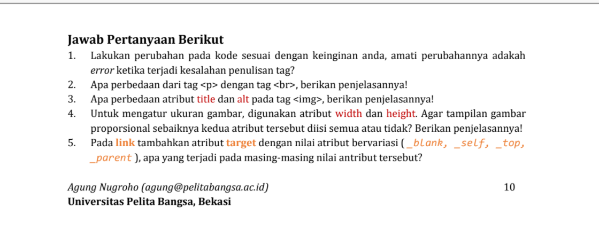

#Dasar Menggunakan Bahasa Program HTML<hr>



###Perbedaan tag `<p>` dan `<br>`?

Fungsi dari tag `<p>` membuat paragraf baru, sedangkan `<br>` membuat paragraf baru dan memberikan jarak pada paragraf pertama yang telah dibuat dengan menggunakan tag`<p>`.

```html
    <!--ini adalah paragraf pertama-->
    <p> 
        Kami sedang belajar HTML dasar, pada matakuliah Pemrograman Web di Prodi Teknik Informatika 
        Universitas Pelita Bangsa. Pelajaran pertama yang kami dapat adalah membuat tampilan web 
        sederhana dalam rangka mengenal tag-tag dasar HTML.
    </p>
```

```html
    <br> <!--ini adalah paragraf kedua-->
    <p>
        Ini merupakan sebuah paragraf yang terdiri dari beberapa kalimat yang saling
        mendukung sehingga menjadi satu kesatuan. Paragraf dibuat dengan menggunakan
        tag dasar html.
    </p>
```
