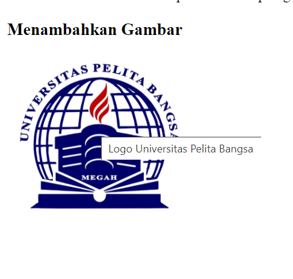
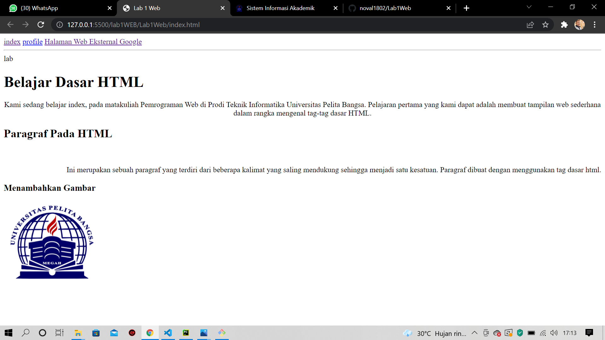
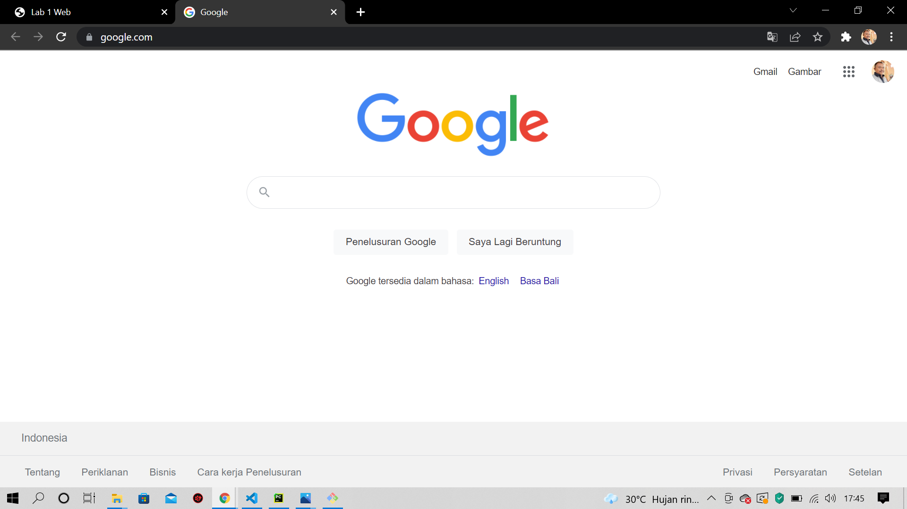
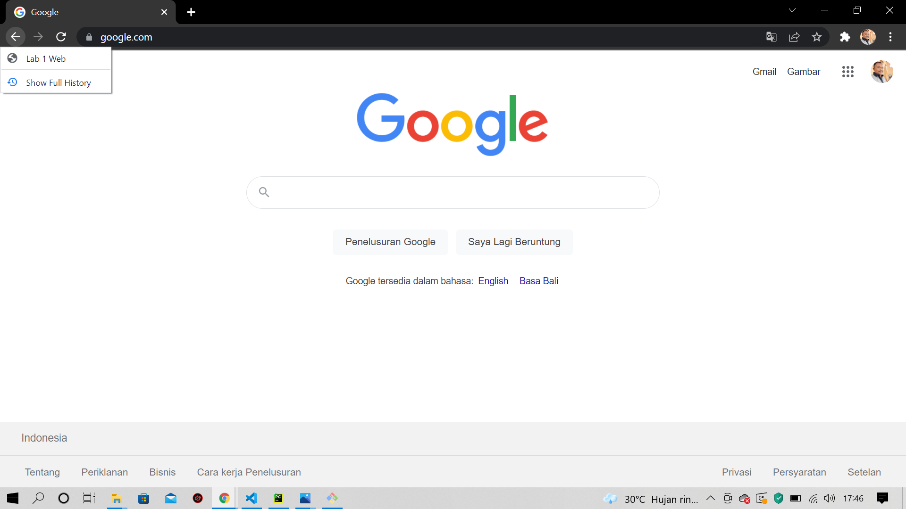

# Dasar Menggunakan Bahasa Program HTML<hr>


### Perbedaan tag `<p>` dan `<br>`?

Fungsi dari tag `<p>` membuat paragraf baru, sedangkan `<br>` membuat paragraf baru dan memberikan jarak pada paragraf pertama yang telah dibuat dengan menggunakan tag`<p>`.

```html
    <!--ini adalah paragraf pertama-->
    <p> 
        Kami sedang belajar HTML dasar, pada matakuliah Pemrograman Web di Prodi Teknik Informatika 
        Universitas Pelita Bangsa. Pelajaran pertama yang kami dapat adalah membuat tampilan web 
        sederhana dalam rangka mengenal tag-tag dasar HTML.
    </p>
```

```html
    <br> <!--ini adalah paragraf kedua-->
    <p>
        Ini merupakan sebuah paragraf yang terdiri dari beberapa kalimat yang saling
        mendukung sehingga menjadi satu kesatuan. Paragraf dibuat dengan menggunakan
        tag dasar html.
    </p>
```

### Perbedaan atriburt dari tag `title` dan `alt` pada tag ``

Jika menggunakan atribut `title` maka saat crusor berada tepat digambar akan muncul title dari gambar tersebut


```html

```
Jika menggunakan atribut `alt` tidak bisa menampilkan title dari gambar tersebut
```html

```


### Menjelaskan atribut ukuran gambar dengan menggunakan `width` dan `height` atau panjan lebar
Untuk mengukur panjang tidak harus disamakan dengan ukuran lebar gambar, bisa di ukur sepantas-pantasnya

```html

```
### Perbedaan 4 atribut target link _self,_blank,_parent,_top
* `_self` - Bawaan. Membuka dokumen di jendela/tab yang sama dengan yang diklik <br>
* `_blank` - Membuka dokumen di jendela atau tab baru<br>
* `_parent` - Membuka dokumen di bingkai induk<br>
* `_top` - Membuka dokumen di seluruh badan jendela<br>

 <br>
<br>
```html
<a href="http://www.google.com/" target="_self">Halaman Web Eksternal Google</a>
<a href="http://www.google.com/" target="_blank">Halaman Web Eksternal Google</a>
<a href="http://www.google.com/" target="_parent">Halaman Web Eksternal Google</a>
<a href="http://www.google.com/" target="_top">Halaman Web Eksternal Google</a>
```